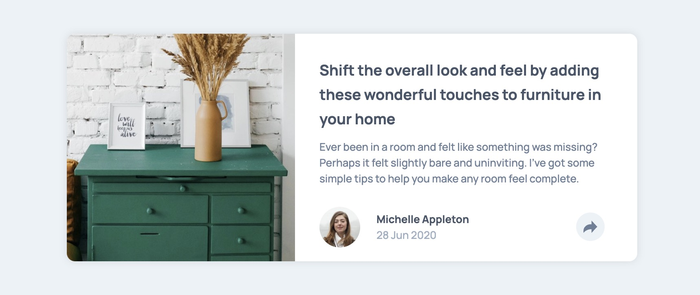
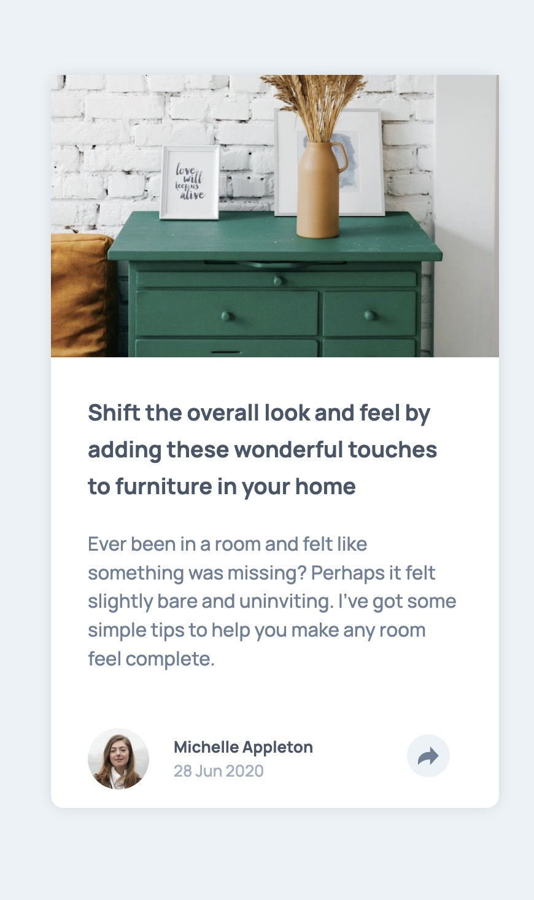

# Frontend Mentor - Article preview component solution

This is a solution to the [Article preview component challenge on Frontend Mentor](https://www.frontendmentor.io/challenges/article-preview-component-dYBN_pYFT). Frontend Mentor challenges help you improve your coding skills by building realistic projects. 

<center>
</br>

</center>


## Table of contents

- [Overview](#overview)
  - [The challenge](#the-challenge)
- [My process](#my-process)
  - [Built with](#built-with)
  - [What I learned](#what-i-learned)
  - [Continued development](#continued-development)


## Overview

### The challenge

Users should be able to:

- View the optimal layout for the component depending on their device's screen size
- See the social media share links when they click the share icon


## My process

### Built with

- HTML
- CSS
- event handlers
- Mobile-first workflow

### What I learned

I got really excited about this project!!!  It seemed simple at first but I realized how fun (and difficult) web development can be.  I had a terrible time with the image.  I was very unfamiliar with the different css properties regarding imgages - how to make them fit properly, how to scale them, and how to allow them to move when resizing.  

I did, however, really enjoy the javascript portion of this project.  Making the flat design come alive through interaction is why I decided to persue a career in web development.  I even added a little css flair by having the arrow spin when clicked.

Really proud of this code:
```css
if (!share.classList.contains("close")) {
    shareButton.style.transform = "rotate(0deg)";
    shareButton.style.background = "hsl(210, 46%, 95%)";
  } else {
    shareButton.style.transform = "rotate(270deg)";
    shareButton.style.background = "hsl(210, 46%, 95%)";
  }
```


### Continued development

I definitely need to study css image properties!  I also want to play around with more CSS transitions and javascript event listeners.