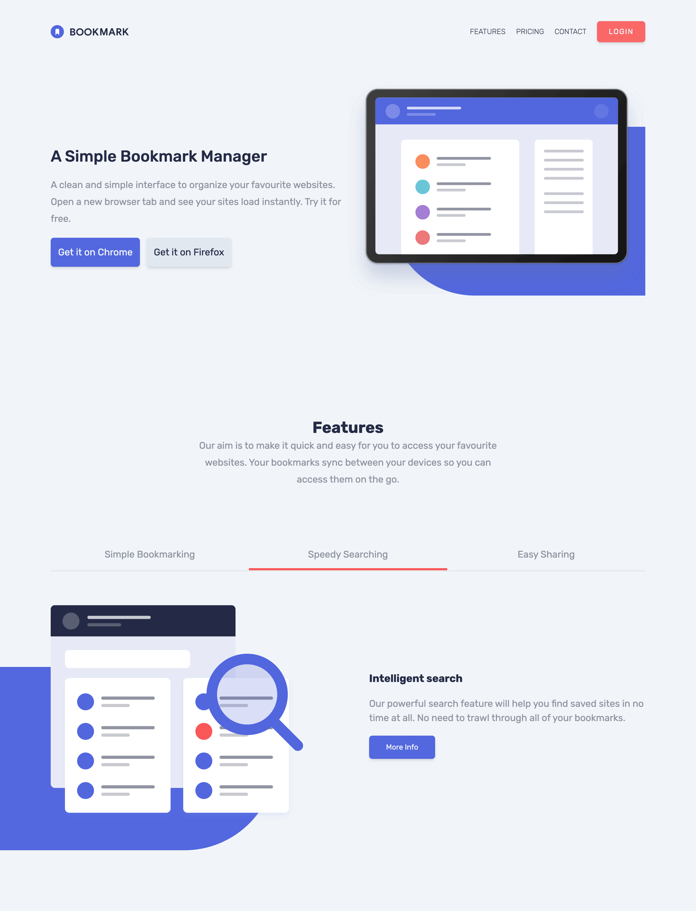
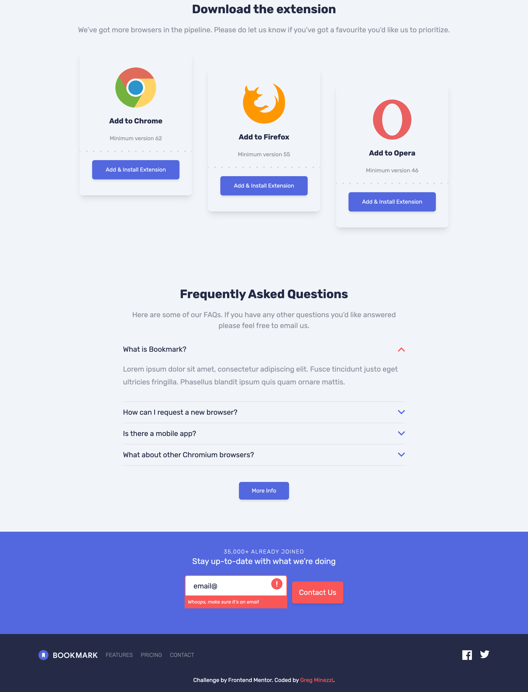
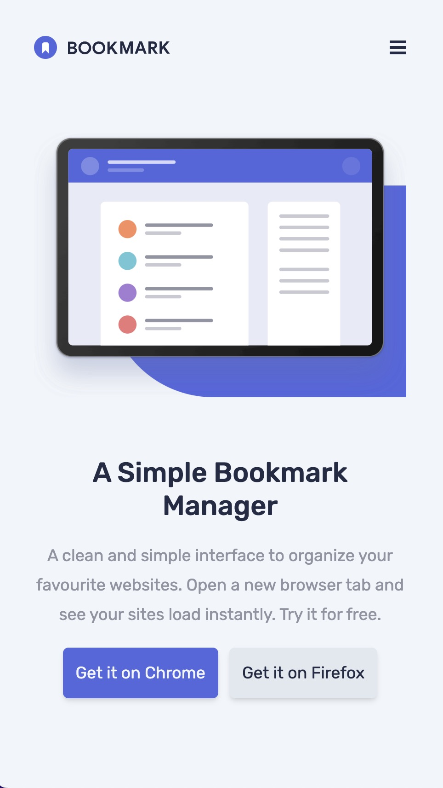
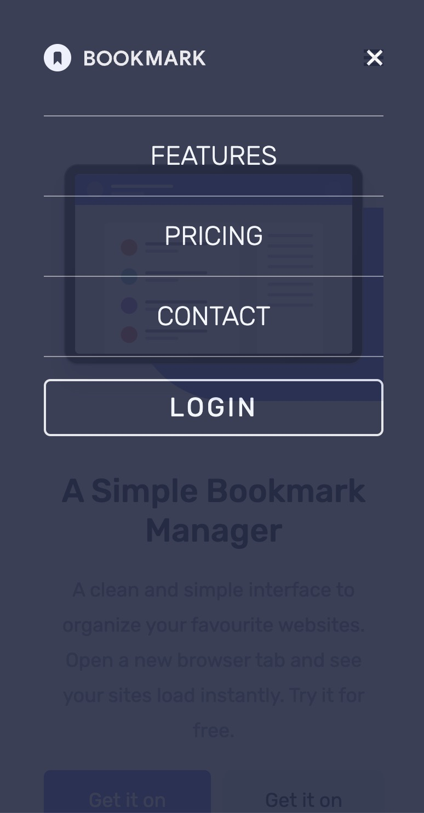

# Frontend Mentor - Bookmark landing page solution

This is a solution to the [Bookmark landing page challenge on Frontend Mentor](https://www.frontendmentor.io/challenges/bookmark-landing-page-5d0b588a9edda32581d29158). Frontend Mentor challenges help you improve your coding skills by building realistic projects. 

## Table of contents

- [Overview](#overview)
  - [The challenge](#the-challenge)
  - [Links](#links)
- [My process](#my-process)
  - [Built with](#built-with)
  - [What I learned](#what-i-learned)
  - [Continued development](#continued-development)

## Overview

### The challenge

- View the optimal layout for the site depending on their device's screen size
- See hover states for all interactive elements on the page
- Receive an error message when the newsletter form is submitted if:
  - The input field is empty
  - The email address is not formatted correctly

For this challenge you'll need to:

- Create the rounded blue background shape with code
- Change the `fill` and `stroke` color of the SVGs at specific points 

### Links

Live: [Bookmark landing page](https://frontendmentor-gm.vercel.app/bookmark-landing-page-master/)

## My process

### Built with

- HTML
- Tailwind CSS
- Vanilla JavaScript
- Flexbox
- Mobile-first development
- Fully responsive

### What I learned

Another project I'm really proud of!  Although the layout of this was pretty straight forward, there were a lot of opportunities to learn.  Additionally, I have become very reliant on frameworks such as React, this was  great opportunity to continue working and learning skills in Vanilla JavaScript.  

Some of the key take aways from this project are: 

- I learned how to change the fill and stroke of SVGs - especially when using tailwind.  I feel this is a very important skill to have as web development is very much a visual art. 

- In the features section, how to highlight the selected section that is currently viewed

- Tailwind is an amazing tool!  It makes development much faster because there is no need to switch back and forth between css files.  But - I'm finding it extremely repetitive.  My next project I may go back to regular css, or reply on react components to map through arrays

### Continued development

I am very happy with this page!  I'm slowly learning some common design practices and would like to create my own site from scratch.  I often think that a site like this is rather plain, but it is extremely clean and to the point - which is very important.  I'm also interested in learning Framer Motion of GSAP.  I thought to add some animations to this with Framer Motion, but as that is used in conjunction with React, it will have to wait for another project.
