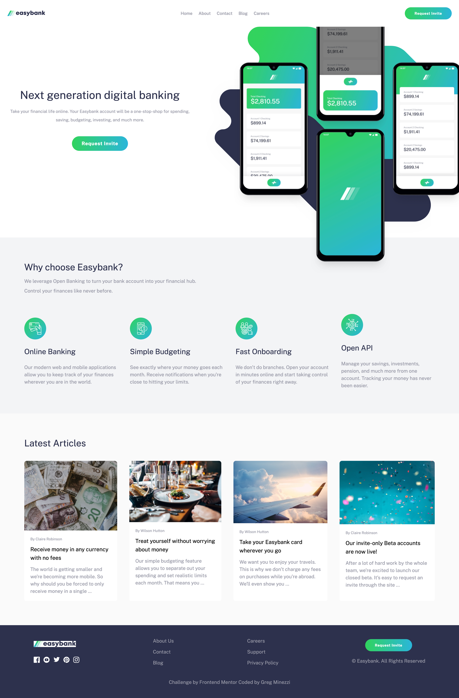
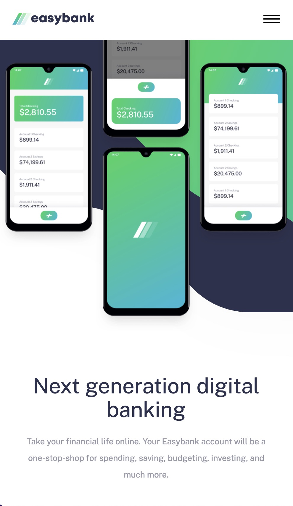
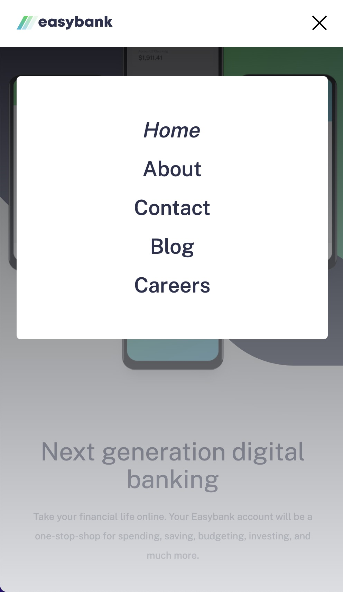

# Frontend Mentor - Easybank landing page solution

This is a solution to the [Easybank landing page challenge on Frontend Mentor](https://www.frontendmentor.io/challenges/easybank-landing-page-WaUhkoDN). Frontend Mentor challenges help you improve your coding skills by building realistic projects. 

## Table of contents

- [Overview](#overview)
  - [The challenge](#the-challenge)
  - [Links](#links)
- [My process](#my-process)
  - [Built with](#built-with)
  - [What I learned](#what-i-learned)
  - [Continued development](#continued-development)

## Overview

### The challenge

Users should be able to:

- View the optimal layout for the site depending on their device's screen size
- See hover states for all interactive elements on the page (buttons, links, card images...)

### Links

Not deployed yet

## My process

### Built with

- HTML
- Tailwind CSS
- JavaScript
- Flexbox
- Mobile-first development
- Fully responsive

### What I learned

I'm really proud of this project!  I was able to finish it quickly with few challenges.  I'm really proud that I was able to use tailwind so seamlessly.  What I learned most about this project was that there is a definite formula when creating landing pages.  Yes, styles and presentation change, but there is a set format of what to include and how to include it.  I'm getting really good at viewing the sketches for mobile and desktop and planning out how exactly I want to strucutre my HTML before begining.  

### Continued development

There are a couple of CSS effects that I wanted to include, but felt a bit stumped when trying to implement them in tailwind.  For example, I wanted an underline to appear under links when hovered that would grow from the center.  I know how to create this in CSS, but in tailwind it seemed more difficult.  I would like to continue to work on this project and implement this in tailwind.
