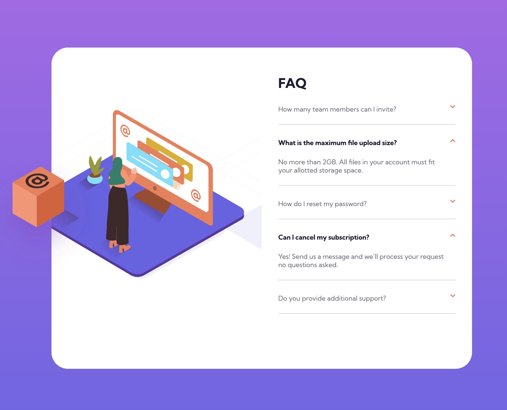
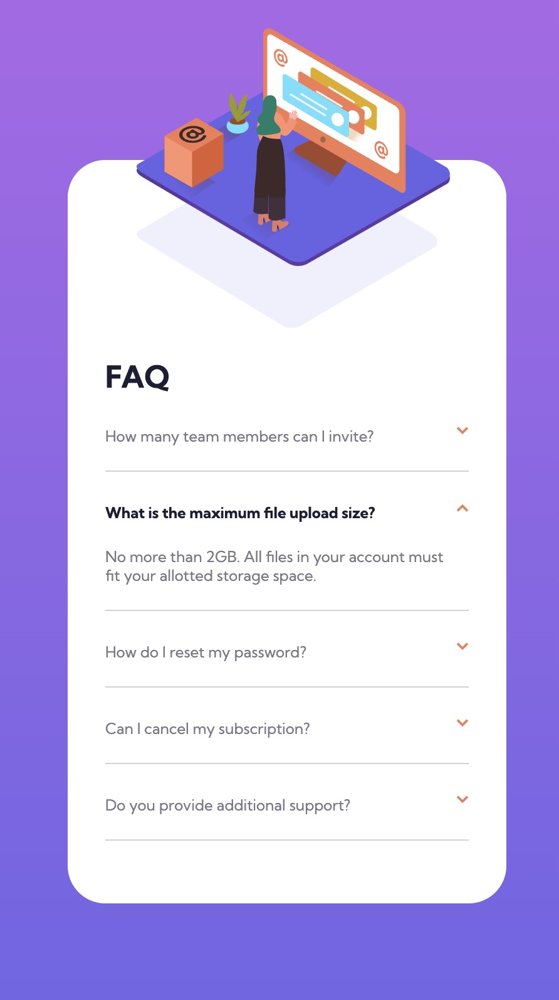

# Frontend Mentor - FAQ accordion card solution

This is a solution to the [FAQ accordion card challenge on Frontend Mentor](https://www.frontendmentor.io/challenges/faq-accordion-card-XlyjD0Oam). Frontend Mentor challenges help you improve your coding skills by building realistic projects. 

<center>
</br>

</center>


## Table of contents

- [Overview](#overview)
  - [The challenge](#the-challenge)
- [My process](#my-process)
  - [Built with](#built-with)
  - [What I learned](#what-i-learned)


## Overview

### The challenge

Users should be able to:

- View the optimal layout for the component depending on their device's screen size
- See hover states for all interactive elements on the page
- Hide/Show the answer to a question when the question is clicked


## My process

### Built with

- HTML
- CSS
- Javascript
- query selectors & eventlisteners (toggle)
- Mobile-first workflow


### What I learned

This project drove me crazy.  It seemed fairly simple at first but it really taught me how important positioning is.  The box that is located outside of the main div kept moving all over the window when I resized the browser or when I clicked on one of the dropdowns.  This project also gave me a new found appreciation for developers because they have to keep so many things in mind when developing.  I'm only viewing my project on one screen, but there are so many different sized screens and types of devices.  It's the developers job to create something that will work and look good to all customers.

```javascript
arrow.parentNode.firstElementChild.lastElementChild.classList.toggle("open");
```


### Continued development

I need to dive deeper into css position.  Specifically how to relate: absolute and relative.

