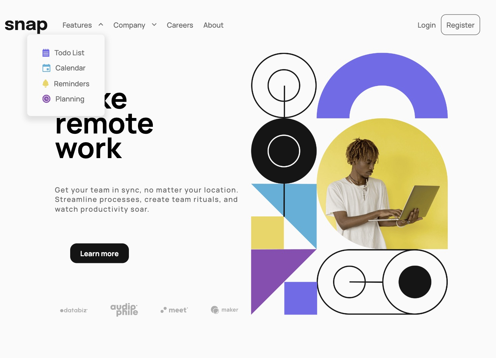
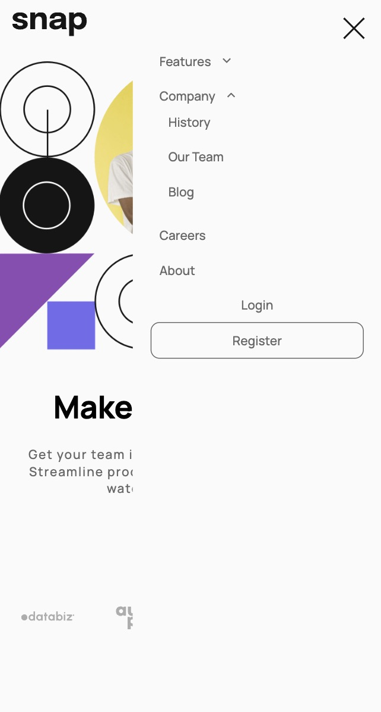

# Frontend Mentor - Intro section with dropdown navigation solution

This is a solution to the [Intro section with dropdown navigation challenge on Frontend Mentor](https://www.frontendmentor.io/challenges/intro-section-with-dropdown-navigation-ryaPetHE5). Frontend Mentor challenges help you improve your coding skills by building realistic projects. 

<center>



</center>


## Table of contents

- [Overview](#overview)
  - [The challenge](#the-challenge)
- [My process](#my-process)
  - [Built with](#built-with)
  - [What I learned](#what-i-learned)
  - [Continued development](#continued-development)


## Overview

### The challenge

Users should be able to:

- View the relevant dropdown menus on desktop and mobile when interacting with the navigation links
- View the optimal layout for the content depending on their device's screen size
- See hover states for all interactive elements on the page


## My process

### Built with

- Semantic HTML5 markup
- CSS custom properties
- Flexbox
- Mobile-first workflow

### What I learned

This was my favorite project yet!  Everything has been fun until now, but they have all been small elements: bits and pieces.  This was a fully developed website from start to finish that included both desktop and mobile!  With this project, I'm really seeing my skills develop and have a glimpse into what a web developer can achieve.

Something I learned on this project was the use of the <picture> element in HTML.  It proved to be very useful since the images change depending on whether desktop or movile version is displayed.  I loved developing the menu bar and styling it with a little extra css transition.

Proud of this code:
```html
<picture>
  <source media="(max-width: 375px)" srcset="../images/image-hero-mobile.png" />
  <source media="(min-width: 776px)" srcset="../images/image-hero-desktop.png" />
  
</picture>
```
### Continued development

Something that I need to look into is whey, on load, you can see the menu bar quickly transition from being open to closed.  I'm guessing it has something to do with the location of my transition.  I'm going to play around with it more and see if I can prevent that from happening.  

