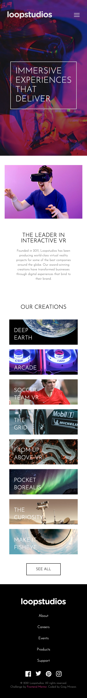

# Frontend Mentor - Loopstudios landing page solution

This is a solution to the [Loopstudios landing page challenge on Frontend Mentor](https://www.frontendmentor.io/challenges/loopstudios-landing-page-N88J5Onjw). Frontend Mentor challenges help you improve your coding skills by building realistic projects.

<p float="left">

 
</p>

## Table of contents

- [Overview](#overview)
  - [The challenge](#the-challenge)
  - [Screenshot](#screenshot)
  - [Links](#links)
- [My process](#my-process)
  - [Built with](#built-with)
  - [What I learned](#what-i-learned)
  - [Continued development](#continued-development)

## Overview

### The challenge

Users should be able to:

- View the optimal layout for the site depending on their device's screen size
- See hover states for all interactive elements on the page

### Screenshots

(see above images)

### Links

- still need to publish

## My process

### Built with

- Tailwind CSS
- Semantic HTML5
- CSS custom properties in tailwind
- Flexbox & Grid
- Mobile-first development

### What I learned

The main focus of this project was to work with Tailwind. This was my first attempt at using it and I honestly found it to be a quite difficult. It's not that tailwind is difficult to learn, as I picked up very quickly on HOW it is implemented. I really enjoy using CSS and I love the flexibility it provides. Using tailwind for the first time, I felt a bit constrained and boxed in. I learned how to use tailwind documentation and how to funnel my ideas of classical css into the predetermined tailwind codes. I see how easy it can be to create a very quick design using tailwind.

My favorite part is how easy it is to make a page responsive. All the tailwind code can be written first for mobile, and then additional code is added right next to the same element!

I also learned how to use different images for mobile/desktop using the `<picture>` tag.
I will admit I had a terrible time with the hero image. I originally used tailwind with custom classes to create different sources for the images:

```html
<header
  class="bg-[url('./images/mobile/image-hero.jpg')] bg-cover bg-center bg-no-repeat 
md:bg-[url('./images/desktop/image-hero.jpg')] "
></header>
```

At first, this worked perfectly, and I was so excited. For whatever reason, when I returned to this project later, it did not work. After spending some time on it, I switched to using the `<picture>` tag once again. But this gave me a lot of issues.

```html
<picture>
  <source media="(max-width: 768px)" srcset="./images/mobile/image-hero.jpg" />
  <source media="(min-width: 768px)" srcset="./images/desktop/image-hero.jpg" />
  
</picture>
```

I finally learned that the image element always shows up on the dom, it is simply the src that is changed. Because of this, the img element is what needs to be styled!

Oh yeah, I am really proud of using this technique though! Both for the custom tailwind property but also the 100dvh so that nothing is hidden by the taskbar!

```html
<header class="h-[calc(100dvh)] md:h-[calc(75vh)]"></header>
```

### Continued development

I would like to continue working with Tailwind and commit it to memory. Although I have a love for CSS, tailwind has proven to be a quick way to add styling to a simple project.
