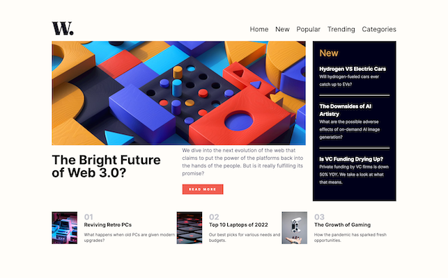
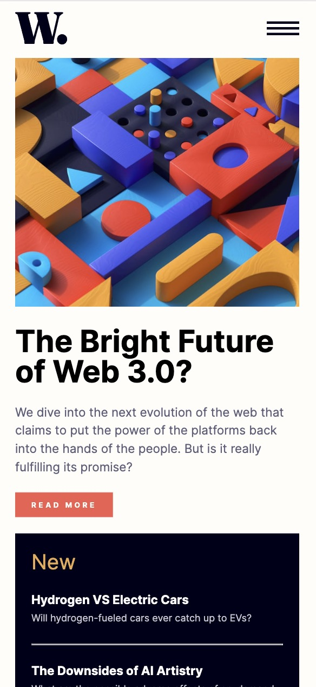
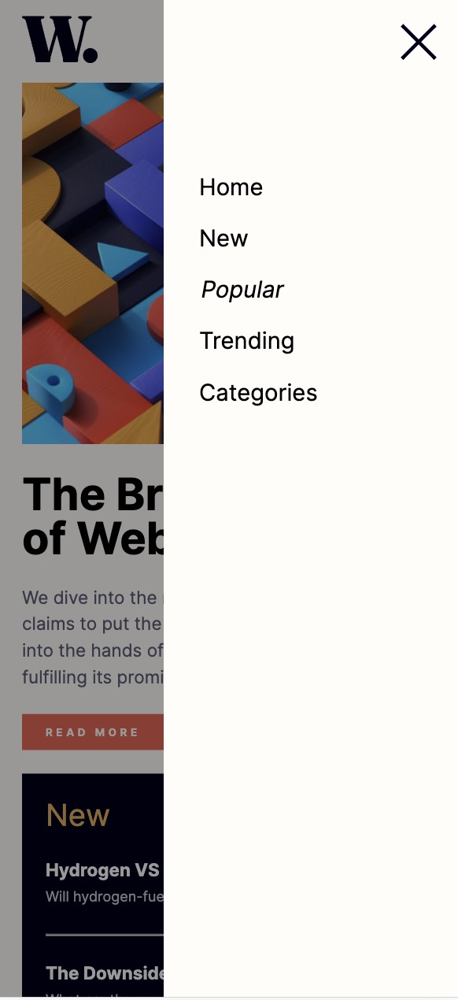

# Frontend Mentor - News homepage solution

This is a solution to the [News homepage challenge on Frontend Mentor](https://www.frontendmentor.io/challenges/news-homepage-H6SWTa1MFl). Frontend Mentor challenges help you improve your coding skills by building realistic projects. 

<p float="left">
   
</p>

## Table of contents

- [Overview](#overview)
  - [The challenge](#the-challenge)
- [My process](#my-process)
  - [Built with](#built-with)
  - [What I learned](#what-i-learned)
  - [Continued development](#continued-development)


## Overview

### The challenge

Users should be able to:

- View the optimal layout for the interface depending on their device's screen size
- See hover and focus states for all interactive elements on the page


## My process

### Built with

- Semantic HTML5 markup
- CSS
- JavaScript: event listeners
- Flexbox
- Mobile-first workflow


### What I learned

This is another great example about how my skills have developed form creating small little web elements to entire web pages.  Although simple, this page shows off my skills of html, css, and vanilla javascript to create a simple page with menu bar interaction.  It is also built mobile first and responsive for larger screen.   However, this project challanged me with spacing, padding, and margin.  I was consistently had issue where the logo would go off the page or there would be a horizontal scroll bar viewable. 

I'm pretty happy with the way I was able to create an overlay for the main page that would dim it slightly when the menu bar was open.  I also used the inset: 0 property which I recently learned.  This is much easier than assigning top, bottom, left, and right all to 0.

```javascript
hamburger.addEventListener("click", () => {
  navItems.style.right = "0";
  dim.style.display = "block";
  body.style.overflow = "hidden";
})
```

### Continued development

I loved using inset: 0.  I want to continue to look into new css developments so learn more techniques as well as ways to simplify my code.  I also have realized how helpful it can be to add comments in my CSS code so I can clearly see which sections that code pertains to. 