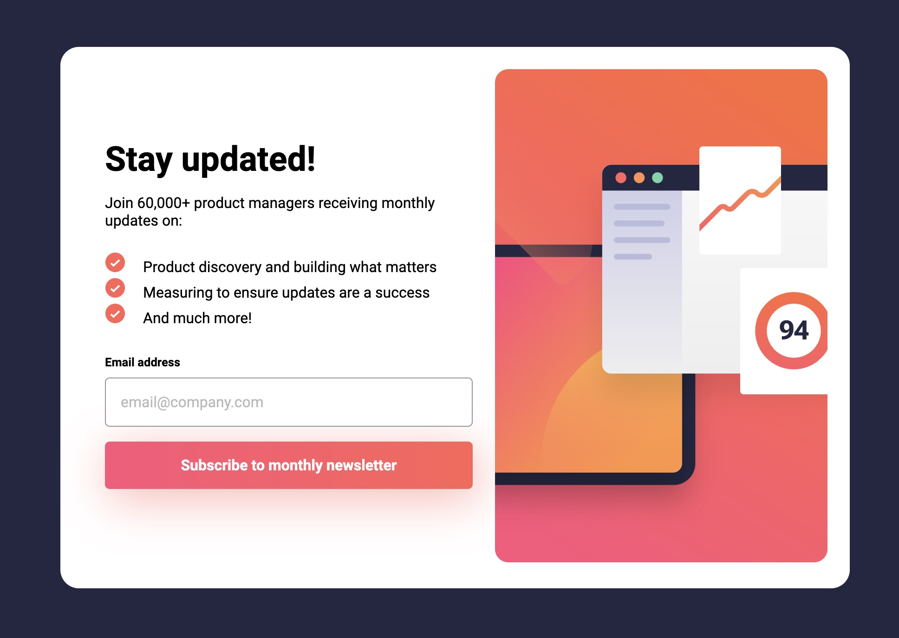
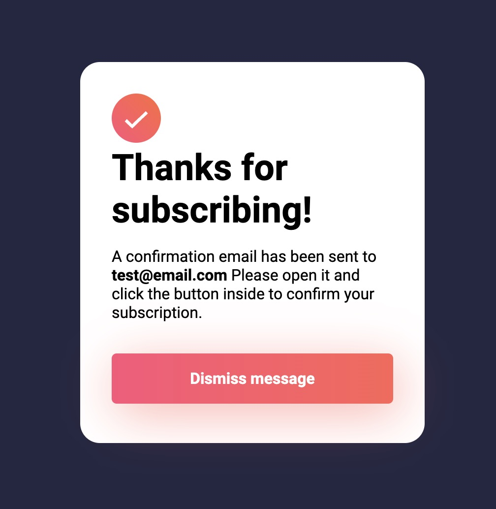
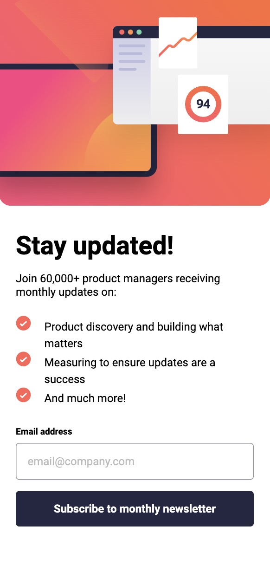

# Frontend Mentor - Newsletter sign-up form with success message solution

This is a solution to the [Newsletter sign-up form with success message challenge on Frontend Mentor](https://www.frontendmentor.io/challenges/newsletter-signup-form-with-success-message-3FC1AZbNrv). Frontend Mentor challenges help you improve your coding skills by building realistic projects.

 
 

## Table of contents

- [Overview](#overview)
  - [The challenge](#the-challenge)
  - [Screenshot](#screenshot)
- [My process](#my-process)
  - [Built with](#built-with)
  - [What I learned](#what-i-learned)
  - [Continued development](#continued-development)

## Overview

### The challenge

Users should be able to:

- Add their email and submit the form
- See a success message with their email after successfully submitting the form
- See form validation messages if:
  - The field is left empty
  - The email address is not formatted correctly
- View the optimal layout for the interface depending on their device's screen size
- See hover and focus states for all interactive elements on the page

### Screenshot

See Above

## My process

### Built with

- Semantic HTML5 markup
- CSS custom properties
- Flexbox
- CSS Grid
- Mobile-first workflow
- Javascript: form submission, eventlisteners

### What I learned

I actually did this project quite a while ago. I have learned a lot since I first started this project. It was interesting to see the techniques I used and how I could improve on them. Going back to this project also taught me a lot about reviewing code. At first I found it very confusing and hard to follow what elements were being targeted because many of my class names were not clear or things were not separated into their own divs. I learned how important it is to write neat and clean code so that it can be read easily by anyone that may review it.

### Continued development

Going back to this project showed me that, although creating apps takes a lot of skill, it takes even more to look at old code and edit. I'd like to go back to some of my old projects and continue to work on them and edit them. I hope this will help me develop my skills of looking at other people's code and being able to quickly and easily understand and visualize it.
