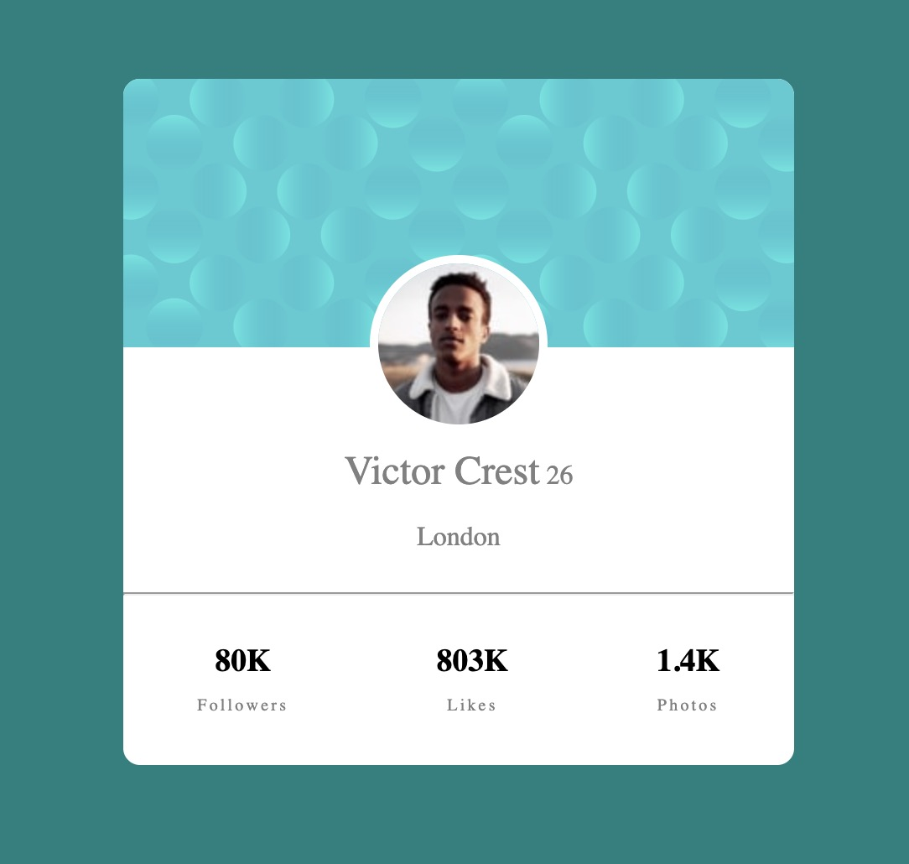

# Frontend Mentor - Profile card component solution

This is a solution to the [Profile card component challenge on Frontend Mentor](https://www.frontendmentor.io/challenges/profile-card-component-cfArpWshJ). Frontend Mentor challenges help you improve your coding skills by building realistic projects. 

## Table of contents

- [Overview](#overview)
  - [The challenge](#the-challenge)
- [My process](#my-process)
  - [Built with](#built-with)
  - [What I learned](#what-i-learned)
  - [Continued development](#continued-development)

## Overview

### The challenge

- Build out the project to the designs provided

## My process

### Built with

- Semantic HTML5 markup
- CSS custom properties
- Flexbox

### What I learned

This project was my first experimentation with the website Frontend Mentor.  At the start I was very confused and not really confident in my skills.  The most important thing I learned in working on this project is that it is so important to plan ahead.  Before writing any code, I had to think about how I wanted to place my divs on the DOM and how I could manipulate them when needed.

### Continued development

I need to work on using semantic HTML and make sure that everything I need is placed in its own divs.
