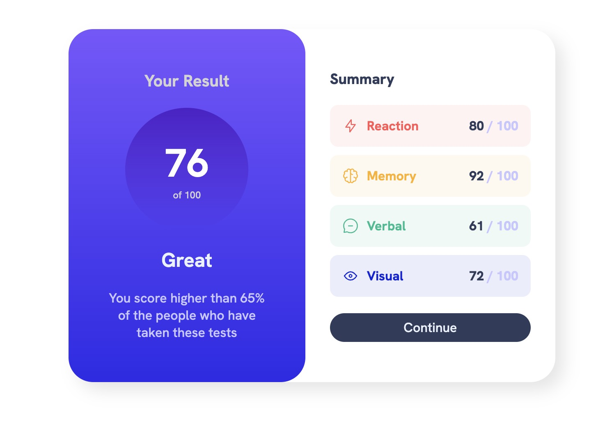
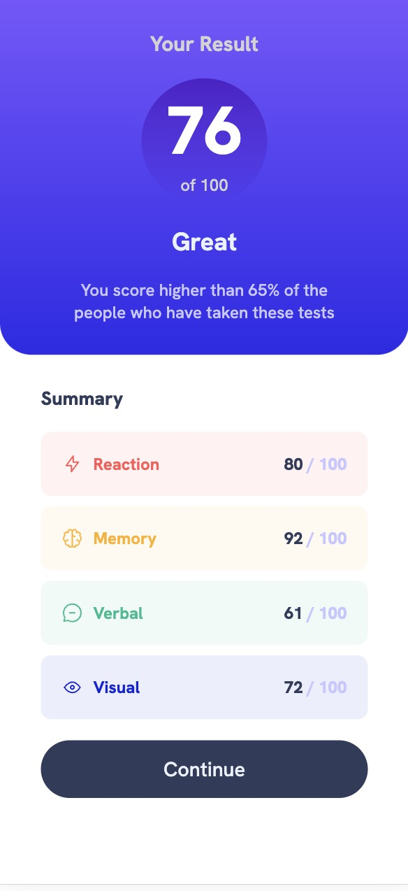

# Frontend Mentor - Results summary component solution

This is a solution to the [Results summary component challenge on Frontend Mentor](https://www.frontendmentor.io/challenges/results-summary-component-CE_K6s0maV). Frontend Mentor challenges help you improve your coding skills by building realistic projects. 

<p float="left">
   
</p>
## Table of contents

- [Overview](#overview)
  - [The challenge](#the-challenge)
- [My process](#my-process)
  - [Built with](#built-with)
  - [What I learned](#what-i-learned)
  - [Continued development](#continued-development)


## Overview

### The challenge

Users should be able to:

- View the optimal layout for the interface depending on their device's screen size
- See hover and focus states for all interactive elements on the page


## My process

### Built with

- Semantic HTML5 markup
- CSS
- CSS gradients
- Flexbox
- Vanilla JavaScript
- fetch from local json file
- Mobile-first workflow


### What I learned

This was a gerat project.  I really enjoyed the CSS that went along with it; including the background gradients, border radiuses, and the varried background colors for each score.  

At first I didn't include any Javascript and simply entered the data in the HTML file.  I later went back and created an index.js file and created some simple Javascript that would fill in any data that could be found in the local data.json file.  It too me a moment because I was not able to access the information I was retrieving.  I learned a little bit more about promises and using .then statements and async functions.  


### Continued development

I'm happy with my app and really pleased that I was able to implmen the Javascript to go along with the data.json file.  One thing I have been thinking about devloping would be a way to alternate colors without haveing to explicitly assign them.  I'm thinking I could create an arary of the five colors and then each score div would have a background color of:
```javascript
colors[scores[i] % colors.length]
```
