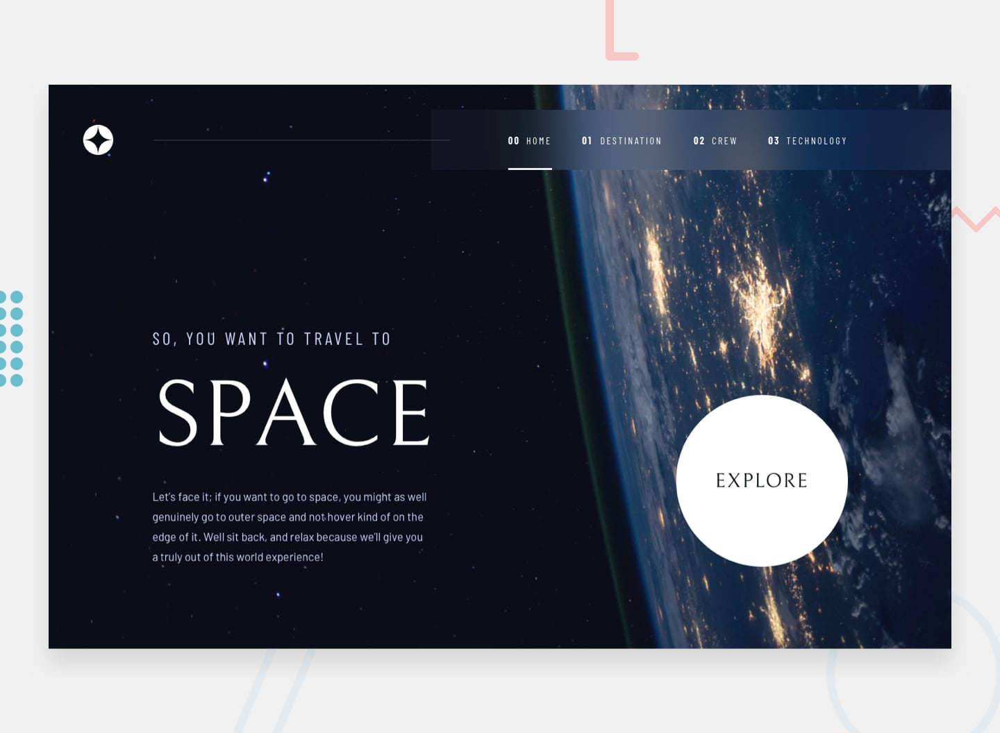
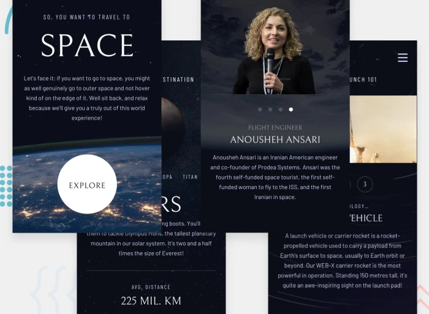

# Frontend Mentor - Space tourism website

This is a solution to the [Space tourism multi-page website challenge on Frontend Mentor](https://www.frontendmentor.io/challenges/space-tourism-multipage-website-gRWj1URZ3). Frontend Mentor challenges help you improve your coding skills by building realistic projects. 

## Table of contents
 
- [Overview](#overview)
  - [The challenge](#the-challenge)
  - [Links](#links)
- [My process](#my-process)
  - [Built with](#built-with)
  - [What I learned](#what-i-learned)
  - [Continued development](#continued-development)

## Overview

### The challenge

Your users should be able to:

- View the optimal layout for each of the website's pages depending on their device's screen size
- See hover states for all interactive elements on the page
- View each page and be able to toggle between the tabs to see new information

### Links

Live: [URL Shortening API](https://space-tourism-gm.vercel.app/)
Code: [github repo](https://github.com/minezzig/frontend-mentor/tree/main/space-tourism)

## My process

### Built with

- Semantic HTML5
- CSS, transitions, animations, media-queries
- React
- Mobile-first workflow
- fetch data from json file

### What I learned

This project was a lot of fun to work on and really helped me review regular CSS. I've spent a lot of time using Tailwind (which I've fallen in love with), but I have become reliant on its ease of use. One main objective of this project was to go back and work on regular CSS. I usually use CSS modules, but I decided to use one index CSS file in this web application.

Something that I learned is to really sit back and study a project before beginning. Take a good amount of time to see how the web app adapts to mobile, tablet, and desktop, and create a game plan for how I want to structure things. It also reminded me of the importance of DRY (Don't Repeat Yourself) and creating reusable CSS classes to ensure that I'm not writing more code than I have to.

I also learned that moving from development to deployment always has its issues. 😊 It is important to make sure that the file structure is correct, as well as the URLs that access files within the project.

### Continued development

There are a few things I'd like to go back and work on in this project. Firstly, I would love to add a carousel/slider for the crew members. The dot track bar also shifts slightly depending on which crew member is being viewed. I'd like to make this more stationary.

I would also like to add more movement to the page. Perhaps have items appear or slide in. I'm really happy with my decision to add animation to the planets and have them spin.