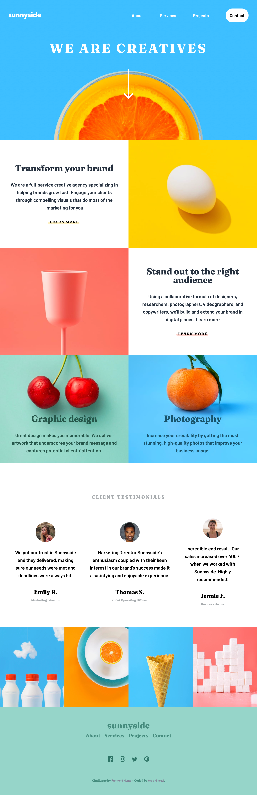
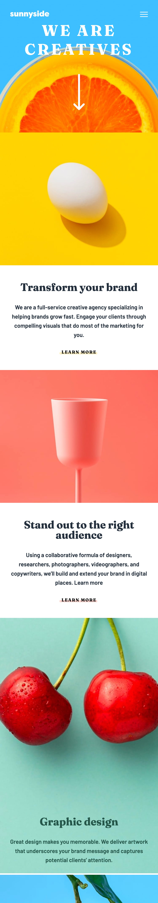
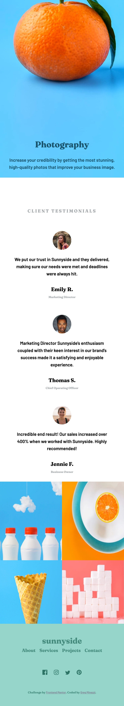

# Frontend Mentor - Sunnyside agency landing page solution

This is a solution to the [Sunnyside agency landing page challenge on Frontend Mentor](https://www.frontendmentor.io/challenges/sunnyside-agency-landing-page-7yVs3B6ef). Frontend Mentor challenges help you improve your coding skills by building realistic projects.

 
 

## Table of contents

- [Overview](#overview)
  - [The challenge](#the-challenge)
  - [Screenshot](#screenshot)
- [My process](#my-process)
  - [Built with](#built-with)
  - [What I learned](#what-i-learned)
  - [Continued development](#continued-development)

## Overview

### The challenge

Users should be able to:

- View the optimal layout for the site depending on their device's screen size
- See hover states for all interactive elements on the page

### Screenshot

see above

## My process

### Built with

- Semantic HTML5 markup
- CSS
- Flexbox
- CSS Grid
- Mobile-first workflow

### What I learned

This was a great project to build a complete website. Though there wasn't a lot of Javascript, it was definitely a challenge for CSS alignment. This worked heavily with grid and aligning images within them. I learned more about how to label divs to make them clear and how you can then manipulate them. I struggled a little with the main image - specifically trying to get the image to fit, be responsive, and take up the correct amount of space. One of my favorite parts was the ::before pseudo code that I used on the navigation links within the page. They were very easy to create but gave great style to the page.

### Continued development

As always, I want to continue my work with alignment using grid, and specifically, how to work with images.
