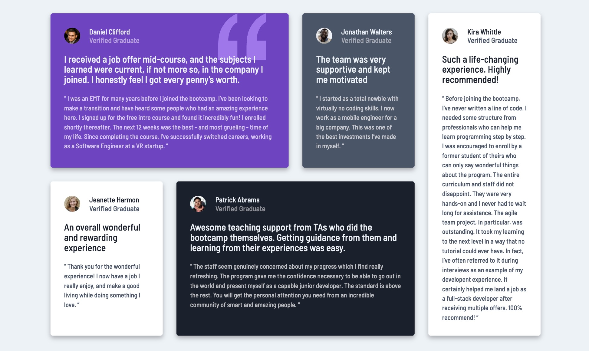
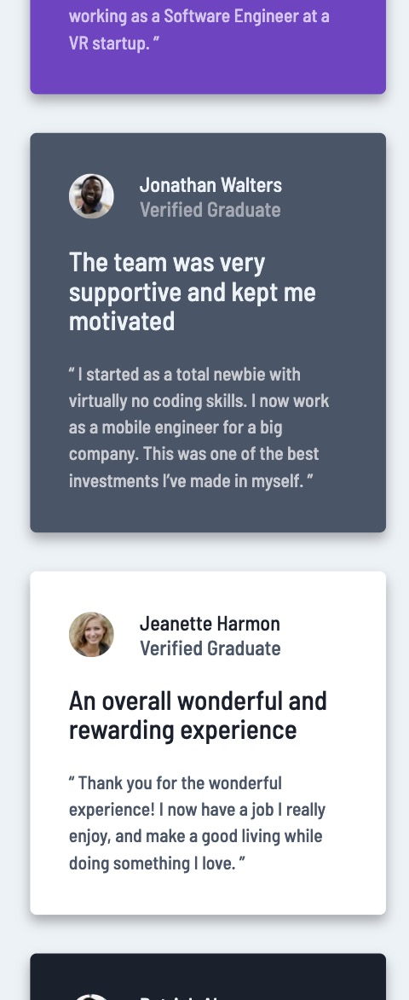

# Frontend Mentor - Testimonials grid section solution

This is a solution to the [Testimonials grid section challenge on Frontend Mentor](https://www.frontendmentor.io/challenges/testimonials-grid-section-Nnw6J7Un7). Frontend Mentor challenges help you improve your coding skills by building realistic projects. 




## Table of contents

- [Overview](#overview)
  - [The challenge](#the-challenge)
  - [Links](#links)
- [My process](#my-process)
  - [Built with](#built-with)
  - [What I learned](#what-i-learned)
  - [Continued development](#continued-development)


## Overview

### The challenge

Users should be able to:

- View the optimal layout for the site depending on their device's screen size

### Links


## My process

### Built with

- Semantic HTML5 markup
- CSS
- CSS Grid
- Mobile-first workflow
- chrome dev-tools


### What I learned

This was my first project with Frontend Mentor!  It was a bit challenging trying to figure it out on my own but it was a good experience.  A lot of the work with this project was learning how to use css grid as well as focusing on responsive layout.  I really learned how to use chrome dev-tools and be able to create mock screens to view my app on different devices. 

I was really excited to learn how to use grid-template-areas and place each element exactly where I want it.

```css
.container {
  grid-template-areas:
    "one one two five"
    "three four four five";
}
#one {
  grid-area:one;
}
#two {
  grid-area:two;
}
```


### Continued development

I need to really learn the ins and outs of grid!  I've focused on flexbox but I realize how effective css-grid can be and how well it works for responsive layouts.  I also need to focus on structuring my HTML using semantic tags.

