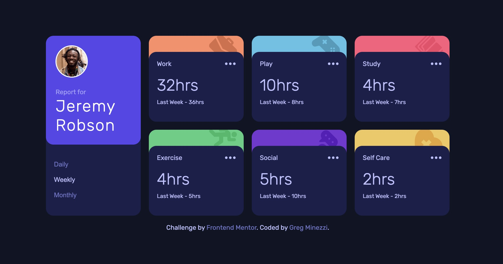
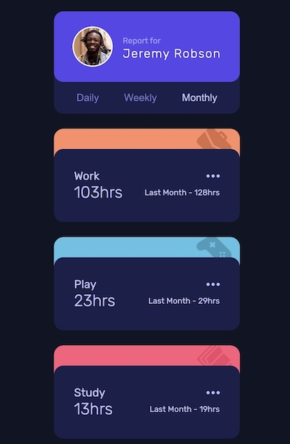

# Frontend Mentor - Time tracking dashboard solution

This is a solution to the [Time tracking dashboard challenge on Frontend Mentor](https://www.frontendmentor.io/challenges/time-tracking-dashboard-UIQ7167Jw). Frontend Mentor challenges help you improve your coding skills by building realistic projects. 



## Table of contents

- [Overview](#overview)
  - [The challenge](#the-challenge)
  - [Links](#links)
- [My process](#my-process)
  - [Built with](#built-with)
  - [What I learned](#what-i-learned)


**Note: Delete this note and update the table of contents based on what sections you keep.**

## Overview

### The challenge

Users should be able to:

- View the optimal layout for the site depending on their device's screen size
- See hover states for all interactive elements on the page
- Switch between viewing Daily, Weekly, and Monthly stats


### Links

- not deployed yet


## My process

### Built with

- Semantic HTML5 markup
- CSS custom properties
- Flexbox & CSS grid
- Mobile-first workflow
- Fetch


### What I learned

I was able to work through this one rather quickly!  It was a rather straight forward design and I loved the colors.  The one thing I really had to think about was how I was going to do the colored tabs with the icon in each.  I also wanted to figure out how I could consolidate my CSS so it was not too repetitive.  

I'm proud of the javascript I wrote for this.  I placed the data in its own file and started by fetching the data.  I also use an object and filtered through to get data depending on the current view.

When I completed the task, I went back and added a few other styles and functions including transitions for the fading numbers as well as functionality to the ellipses that allow a user to share their activity for any given time. 

I learned that there are many different ways to do things!  There is often not a correct or incorrect way of doing something, just different styles.  I also learned the importance of using reusable code.  For the tabs, I styled each the same, and then later added selectors just for the background colors:

```css
.tab {
  height: 3rem;
  z-index: -5;
  border-radius: 15px 15px 0 0;
}
.work .tab {
  background-color: var(--orange);
}
.play .tab {
  background-color: var(--blue);
}
```
I'm pretty happy with this JS code also - ensuring that the singular and plural is taken care of depending on the time
```js
div.innerHTML = `${prevPhrases[view]} - ${hours}${
      hours > 1 || hours === 0 ? "hrs" : "hr"
```

